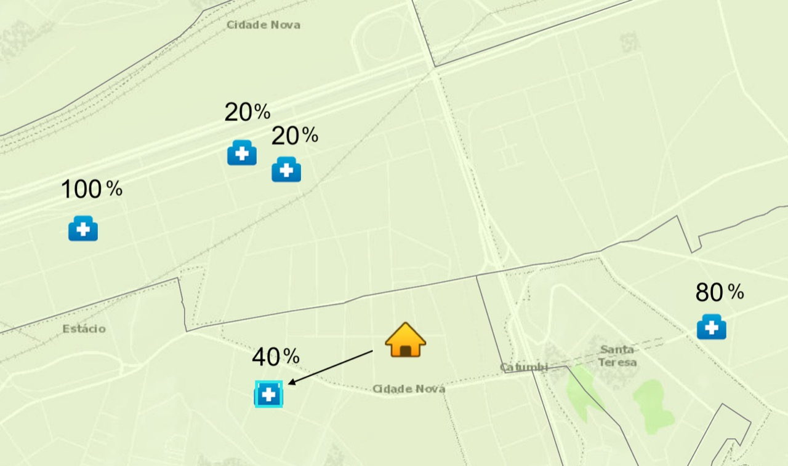

# PATH TO EMERGENCE CARE
Este Repositório do GitHub se destina a desenvolver um MVP para o hackathon HackCovid19. O link do desafio pode ser acessado pela plataforma do DevPost.

https://hackcovid-19.devpost.com/?ref_content=default&ref_feature=challenge&ref_medium=portfolio

O desafio escolhido é o D007 - PATH TO EMERGENCE CARE (PATH TO EMERGENCE CARE), proposto por Jair José Ferronato e descrito em: http://www.cbpf.br/hackcovid19/Hackcovid_Desafios_Todas.html.

Dentre as atribuições do desafio está desenvolver um protótipo e um Pitch até a data limite de 17/05/2020. As orientações para o Pitch podem ser vista no link: http://www.cbpf.br/hackcovid19/pdf/ORIENTA%C3%87%C3%95ES_PARA_O_PITCH_HACKCOVID19.pdf.

# Para baixar os dados do Projeto

1) Baixar o Dataset de Capacidades no repositório a seguir: 
    https://drive.google.com/file/d/1kZ04ArPCvKn8-hR9w8r8pOF_29OeN3Kj/view?usp=sharing
2) Colocar a pasta 'BASE_DE_DADOS_CNES_202003' na raíz do projeto
3) Baixar o Dataset de Demandas no repositório a seguir:
    https://drive.google.com/open?id=1uJAOXa_VDTOqVh0_lXCxypm1ArF5hH0O
    Caso tenha problemas usar codificação "unicode_escape"
3) Usar o comando python3 install.py

# O desafio
O desafio proposto, Caminho para a Emergência, tem a seguinte pergunta chave: 
    Estou precisando de atendimento para Covid-19, para onde devo me deslocar?

A resposta a essa pergunta pode ser complexa, pois em tempos de pandemia, as mudanças ocorrem de forma mais dinâmica e muitos dos hospitais ficam superlotados com a grande procura.

A proposta seria desenvolver um app, que iria utilizar a geolocalização do usuário para poder te encaminhar o paciente para um hospital que tenha:
- o tipo de atendimento necessário;
- caso esteja em caso grave, possua uma emergência;
- seja público ou privado, conforme a escolha;
- e de preferência tenha vagas disponíveis !

A proposta é que o App, com base nas taxas de ocupações, te indique qual a melhor opção de deslocamento para atendimento. Isso Está exemplificado na imagem abaixo, que mostra em cima de cada hospital a taxa de ocupação e com a seta, aponta qual a melhor opção.

# Links Interessantes
Painel da Covid no Rio - https://www.data.rio/app/painel-rio-covid-19

Regiões de Influência das Cidades - REGIC - https://www.ibge.gov.br/geociencias/organizacao-do-territorio/redes-e-fluxos-geograficos/15798-regioes-de-influencia-das-cidades.html?edicao=27334&t=downloads

Covid em tempo real no RS - https://covid.saude.rs.gov.br/

